# 图像增强分析报告

## 一、项目背景与目标

本项目旨在对 ImageNet 数据集中的图像进行**亮度增强处理**，通过设计合理的插值与对比度增强算法，使图像在保持色彩自然的前提下获得更清晰、可识别的亮度结构，提升图像对比度、层次感与细节表现，为后续计算机视觉任务（如分类、检测）提供质量更高的输入数据。

## 二、图像数据集与格式分析

### 图像来源与统计

* 本项目使用了 ImageNet 中的三个类目：

  * 🐱 猫类（n02123045）：1525 张，平均尺寸约 429×429
    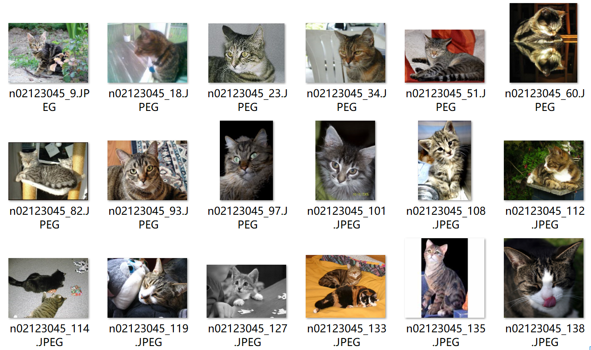
  * 🐭 老鼠类（n02352591）：654 张，平均尺寸约 317×317
    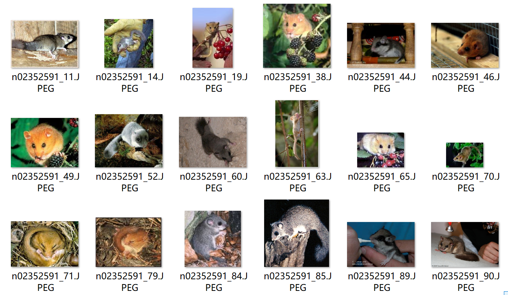
  * 🚜 拖拉机类（n04465501）：1726 张，平均尺寸约 500×500
    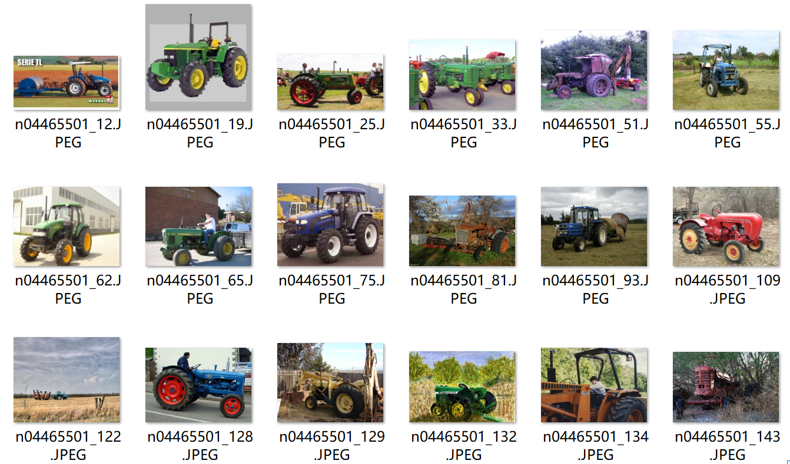
* **总体统计**：
  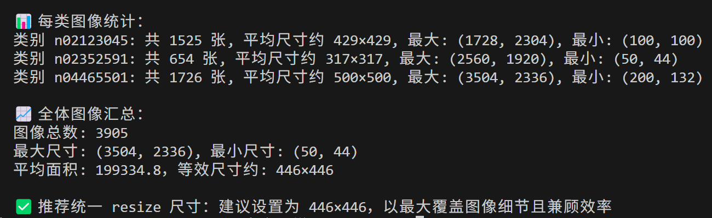

  * 总图像数：3905 张
  * 最小尺寸：50×44，最大尺寸：3504×2336
  * 平均面积：199334.8，
  * 推荐 resize 尺寸为：446×446（平方均值面积开方所得）

> 建议以平均面积开方后的等效尺寸作为缩放标准，以最大覆盖图像细节并兼顾效率。
> 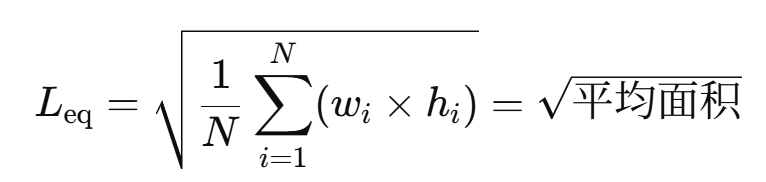

### 图像格式与编码（JPEG）

JPEG 是一种广泛使用的图像压缩格式，采用有损压缩方式，在保持可接受的图像质量的同时大幅减小文件体积。其压缩流程主要包括：

1. **颜色空间转换**：将图像从 RGB 转换为 YCbCr。该过程将图像拆分为亮度通道 Y 和两个色度通道 Cb、Cr。人眼对亮度更敏感，因此压缩时优先保留 Y 通道的信息。
2. **色度子采样**：通常采用 4:2:0 或 4:2:2 格式，对 Cb/Cr 分量进行下采样。
3. **DCT（离散余弦变换）**：将图像分块（如 8x8）并转换到频域，对高频信息进行压缩。
4. **量化与熵编码**：根据量化表对频率系数压缩，采用 Huffman 编码等方式进一步编码存储。

> 在本项目中，由于增强主要针对亮度表现，因此所有操作均集中在 Y 通道，避免对压缩色彩结构造成影响。

### 色彩空间转换：YUV 与 RGB

RGB 色彩空间表达了图像的三种基本颜色通道，适合于图像显示和编辑；
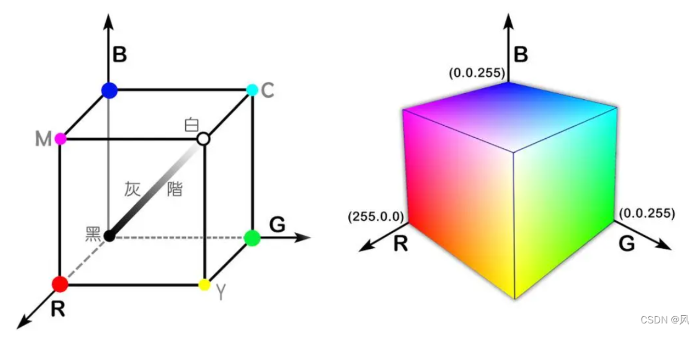 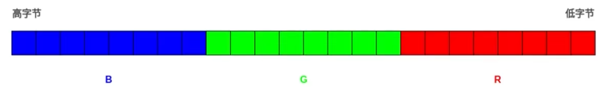
而 YUV（或 YCbCr）则是将图像分为亮度（Y）和色度（U/V 或 Cb/Cr）两部分，更符合人眼感知特性，因此 JPEG 编码和图像增强常在 YUV 空间中进行。
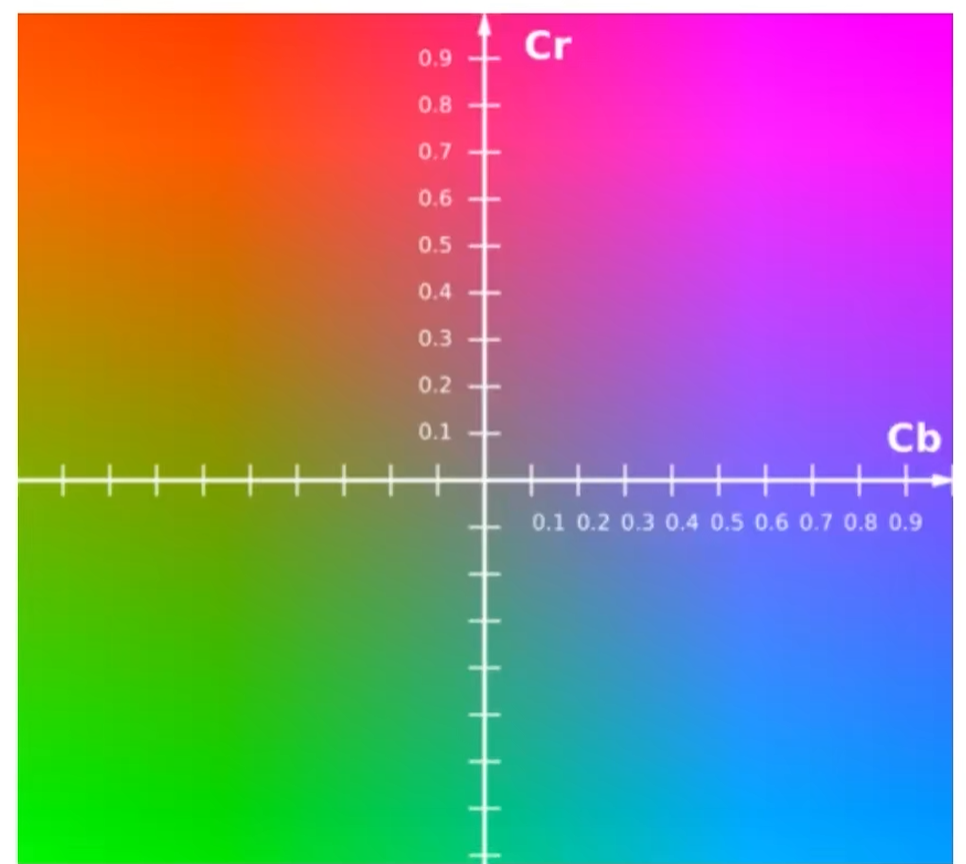
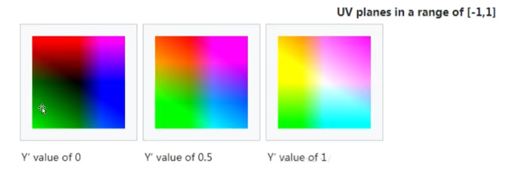

转换过程：
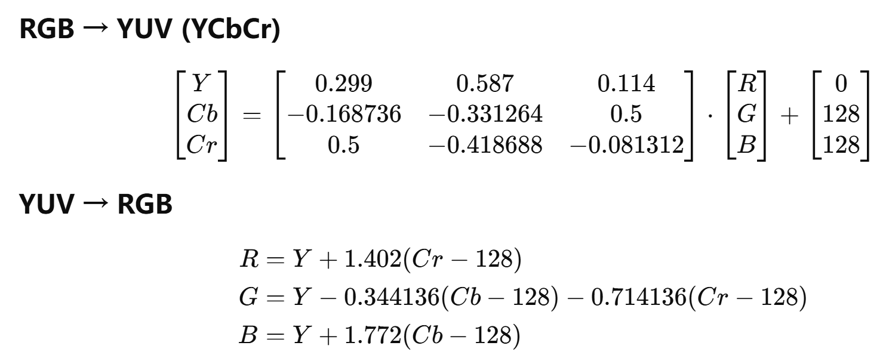

* RGB → YCbCr：提取亮度信息，压缩前预处理
* YCbCr → RGB：增强完成后重建彩色图像

其中转换核心在于：

* Y 通道加权组合了 RGB，反映亮度
* Cb 和 Cr 分别反映蓝色差和红色差

转换逻辑背后是人眼视觉系统对明暗（亮度）更加敏感，对颜色（色差）相对宽容，从而支撑 JPEG 在 Y 通道上高保真压缩、色彩通道低精度处理的策略。

## 三、Resize 策略分析

### 为什么要 Resize？

* 原始图像尺寸差异过大，不利于批量处理和视觉对比
* 统一尺寸可使增强方法对所有图像均有效
* 后续模型训练或分析任务也通常要求输入尺寸一致

### 方法对比与原理分析

| 方法       | 原理                   | 特性与表现         |
| ---------- | ---------------------- | ------------------ |
| 最近邻插值 | 取最接近的像素         | 快速但边缘锯齿明显 |
| 双线性插值 | 四个像素按距离加权平均 | 更平滑、视觉效果佳 |

#### 最近邻插值详解：

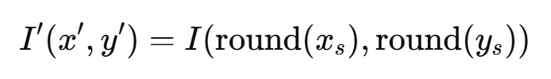
目标图像中的每个像素点，根据比例映射回原图，直接取最近的像素作为输出。该方法实现简单、运算量低，非常适合实时处理。但因为不考虑周围像素关系，图像边缘部分可能产生“锯齿感”。

#### 双线性插值详解：

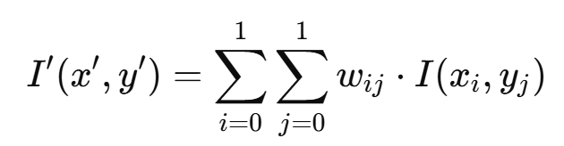
在目标图像每个像素点上，根据其映射回原图的浮点位置，选取其周围 2x2 像素点进行加权平均：权重由与目标点的距离决定，越近权重越大。这种方式可以让图像边缘更平滑，减少视觉突变，是图像增强与图像编辑的常用方法。

> ✅ 本项目采用双线性插值作为主 Resize 策略，在保证增强算法精度的同时提高整体图像质量表现。

## 四、图像增强方法原理与实现

本项目采用四种基于亮度直方图的图像增强技术，分别为：全局直方图均衡化（equalize）、自适应直方图均衡化（CLAHE）、线性对比度拉伸（stretch）以及 Gamma 校正（gamma）。核心思想是通过调整图像亮度分布，使像素值更合理地覆盖动态范围（0\~255），从而提升图像的对比度和可视细节。

统一处理流程如下：

1. 原始 RGB 图像 → YCrCb 色彩空间转换（分离亮度与色彩）
2. 对 Y（亮度）通道使用指定增强方法进行增强
3. 将增强后的 Y 通道与原 Cr/Cb 合并，再转回 RGB 格式生成增强图像

### 方法对比与数学原理

#### 1. 全局直方图均衡化（equalize）

基于累计分布函数（CDF）对像素值非线性重映射：

$$
C(i) = \sum_{j=0}^i h(j) \quad (\text{累计直方图})
$$

$$
x' = \text{round} \left( \frac{C(x) - C_{\text{min}}}{N - C_{\text{min}}} \times 255 \right)
$$

该方法对整个图像的灰度直方图进行均衡处理。首先统计出像素值在 \[0, 255] 范围内的分布频率，构造累计分布函数（CDF），再用该函数将原始像素值非线性地映射到新的灰度空间中，使得图像整体对比度提升。

增强结果对低亮区域尤其明显，适合处理曝光不足的图像。

> | 原图                                                      | 手动增强                                                | cv2增强图                                              | 直方图                                                                  |
> | --------------------------------------------------------- | ------------------------------------------------------- | ------------------------------------------------------ | ----------------------------------------------------------------------- |
> |  |  |  | 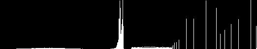 |
> |  |  |  | 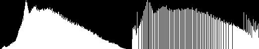 |
> |  |  |  | 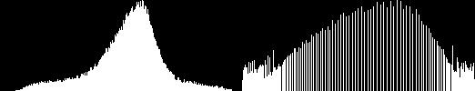 |

> 图示：全局均衡化原理及其直方图重分布过程

#### 2. 自适应直方图均衡化（clahe）

将图像划分为小块，对每个块单独执行均衡化，并限制对比度（clipLimit），防止噪声放大。

每个局部块内部的灰度映射函数：

$$
x'_{\text{tile}} = \frac{C_{\text{tile}}(x)}{N_{\text{tile}}} \cdot 255
$$

##### Step 1：图像划分为 Tile 区域（如 8×8）

最初尝试将图像等分成 8×8 块，每块分别执行直方图均衡。但实际图像尺寸并不总能被 8 整除，如果强行裁切或放弃边角像素，会导致图像内容损失。因此：

> 解决方案： 不固定 tile 的宽高为 tile_w = width // tile_size，tile_h = height // tile_size，而是将整张图划分为 8×8 个区域，每个 tile 的尺寸由图像尺寸自适应计算，这样就能完整覆盖整张图。
>
> | 之前                  | 之后                  |
> | --------------------- | --------------------- |
> | 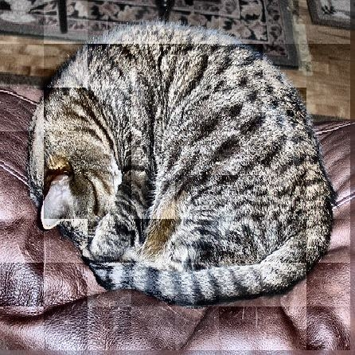 | 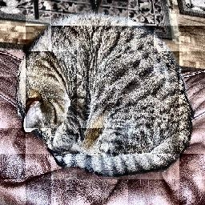 |

##### Step 2：局部增强过度，噪声与伪影放大

原始实现中对每个 tile 执行标准均衡化，导致暗部亮度被极端拉高，图像中本应平滑的区域出现噪声甚至伪边界。出现这一问题的根源是：小区域内像素分布集中时，直方图容易出现某些强峰，均衡化会将其拉伸至整个亮度范围。

> 解决方案： 借鉴 OpenCV 中 CLAHE 的裁剪限制策略，引入 clipLimit 参数，将每个灰度 bin 的最大频率限制为 clipLimit，超过部分在所有 bin 中平均分摊，防止局部对比度过高。

##### Step 3：Tile 之间边缘出现“硬拼接”痕迹

在最初版本中，增强后的图像在 tile 边界处明显可见亮度不连续，出现格状拼接痕迹。这是因为每个 tile 各自增强后直接拼接，而不同 tile 所用的均衡化 LUT 差异较大，导致亮度突变。

> 解决方案： 借鉴图像缩放中的双线性插值思想，在每个像素处根据其位于 tile 网格中的相对位置，从其四个邻域 tile 的 LUT 中进行加权平均，实现像素级别的平滑过渡（称为“四邻插值融合”）。
>
> | 之前                  | 之后                  |
> | --------------------- | --------------------- |
> |  | 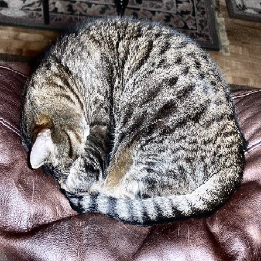 |

CLAHE 的完整流程包括 tile 分割、局部均衡、频率限制、插值融合等多个阶段：
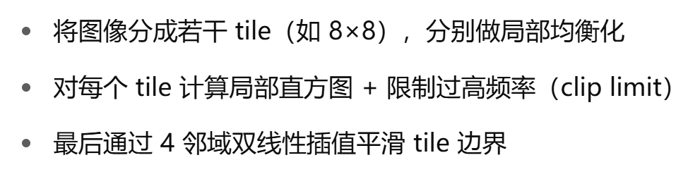

> | 原图                                                      | 手动增强                                             | cv2增强图                                           | 直方图                                                               |
> | --------------------------------------------------------- | ---------------------------------------------------- | --------------------------------------------------- | -------------------------------------------------------------------- |
> |  |  |  |  |
> |  |  |  | 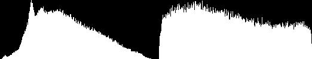 |
> |  |  |  | 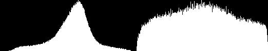 |

> CLAHE 算法对图像局部划分并融合增强，保留更多细节，避免过度对比。

#### 3. 对比度拉伸（stretch）

线性归一化像素灰度范围：

$$
x' = \left( \frac{x - y_{\min}}{y_{\max} - y_{\min}} \right) \cdot 255
$$

这是一个线性映射函数：

$$
f(x) = ax + b, \quad a = \frac{255}{y_{\max} - y_{\min}}, \quad b = -y_{\min} \cdot a
$$

对比度拉伸是一种简单的线性映射方法，将图像中实际使用的像素灰度区间 \[y\_min, y\_max] 映射到 \[0, 255]。

其优势在于处理速度快、结构保真性好，但对极端分布（如多数像素集中于低灰度）改善能力较弱。

> | 原图                                                      | 手动增强                                               | cv2增强图                                             | 直方图                                                                 |
> | --------------------------------------------------------- | ------------------------------------------------------ | ----------------------------------------------------- | ---------------------------------------------------------------------- |
> |  |  |  | 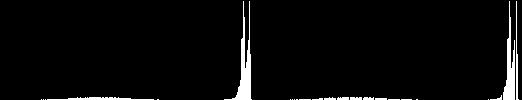 |
> |  |  |  | 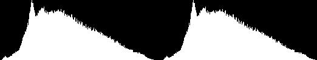 |
> |  |  |  | 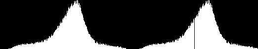 |

> 图示：将原始灰度区间线性拉伸覆盖整个动态范围。

#### 4. Gamma 校正（gamma）

非线性亮度映射：

$$
y' = 255 \cdot \left( \frac{y}{255} \right)^\gamma
$$

当 \$\gamma < 1\$ 提亮暗部；\$\gamma > 1\$ 压缩亮部。

Gamma 校正是一种非线性变换，用于调节图像亮度感知。通过调整参数 gamma，可以选择性地提亮暗部（gamma<1）或压缩亮部（gamma>1）。

这类方法常用于图像感知美化、视频编码等应用中，提供灵活的主观亮度调节手段。

> | 原图                                                      | 手动增强                                             | cv2增强图                                           | 直方图                                                               |
> | --------------------------------------------------------- | ---------------------------------------------------- | --------------------------------------------------- | -------------------------------------------------------------------- |
> |  |  |  | 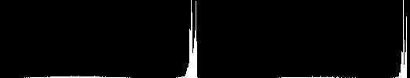 |
> |  |  |  | 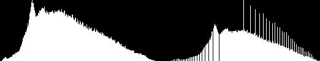 |
> |  |  |  | 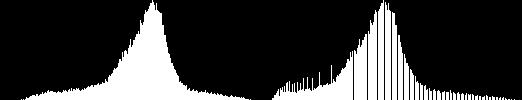 |

> 不同 gamma 下的曲线变化，展示对图像暗部的提亮能力。

### ✅ 技术优势与适用性对比

| 方法     | 变换类型   | 是否自适应 | 特点                             | 适用场景                   |
| -------- | ---------- | ---------- | -------------------------------- | -------------------------- |
| equalize | 非线性全局 | 否         | 简单快速，拉伸集中亮度           | 普通图像、对比度偏低图像   |
| clahe    | 非线性局部 | 是         | 保留细节、防止过度增强           | 医学图像、夜景、人脸增强   |
| stretch  | 线性全局   | 否         | 保比例、不引入非线性失真         | 图像灰度范围窄但无偏暗区域 |
| gamma    | 非线性全局 | 否         | 可调亮度曲线，暗部提亮或亮部压暗 | 光照补偿、感知调整         |

## 五、增强效果对比示例

### 🐱 猫类（n02123045）

| 增强方法 | 增强后图像                                         | 增强前后直方图                                          |
| -------- | -------------------------------------------------- | ------------------------------------------------------- |
| Equalize | 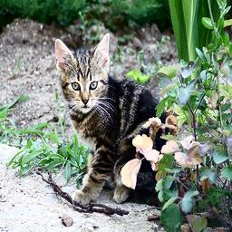 | 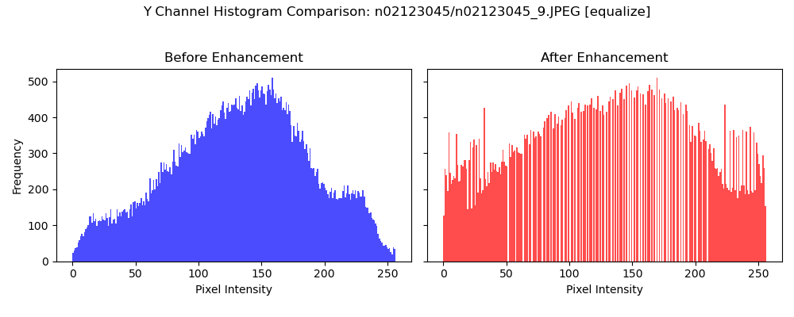 |
| Clahe    | 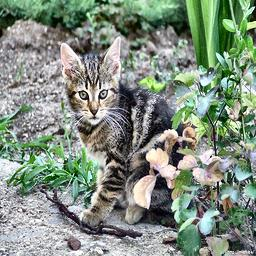    | 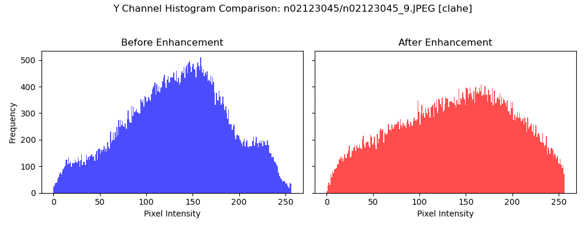    |
| Stretch  |   | 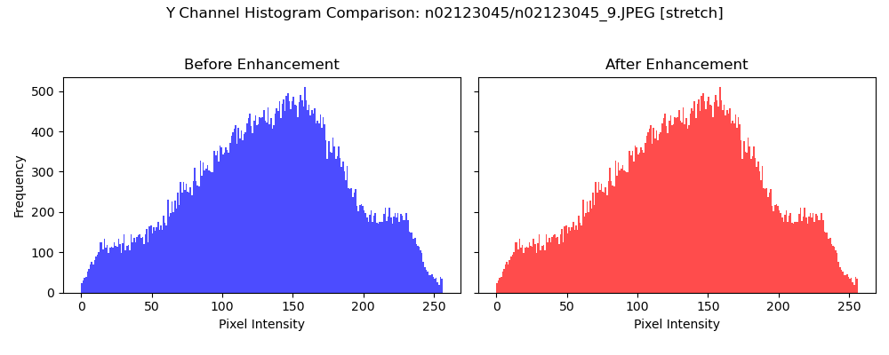  |
| Gamma    |     | 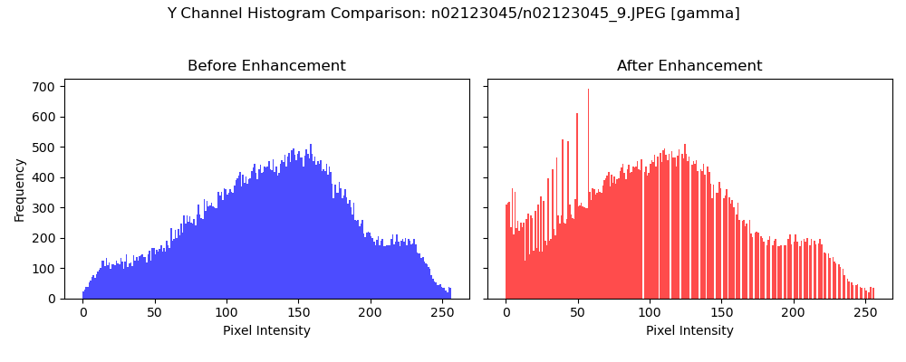    |

### 🐭 老鼠类（n02352591）

| 增强方法 | 增强后图像                                          | 增强前后直方图                                           |
| -------- | --------------------------------------------------- | -------------------------------------------------------- |
| Equalize | 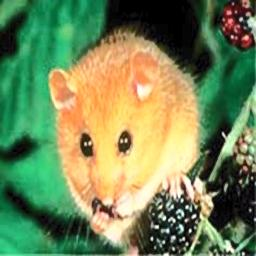 | 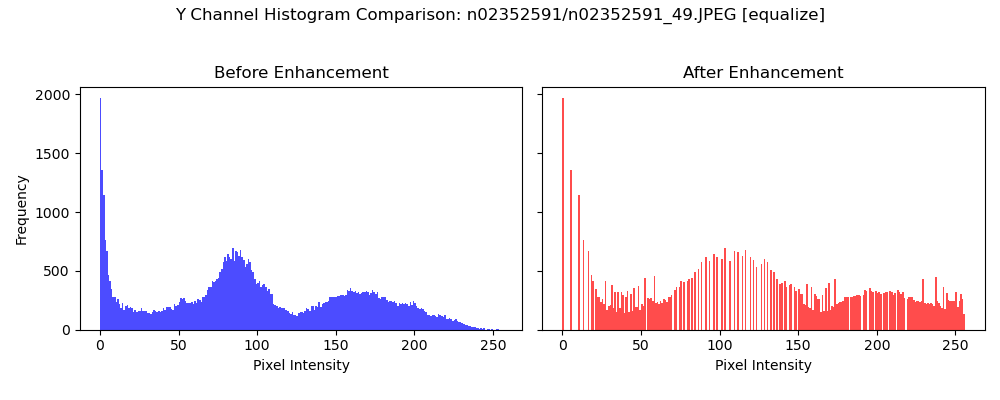 |
| Clahe    | 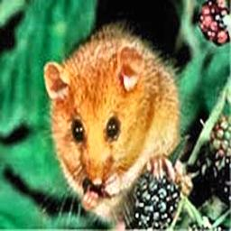    | 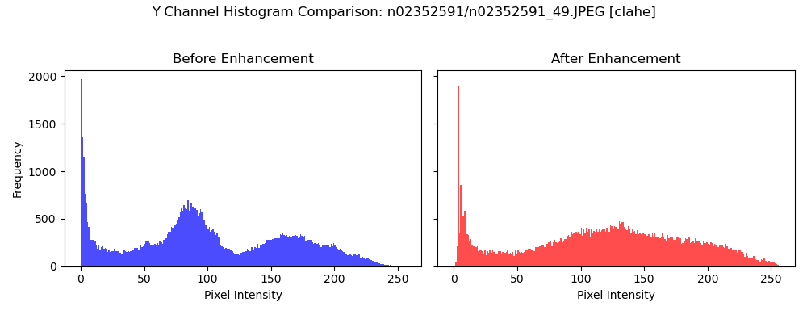    |
| Stretch  | 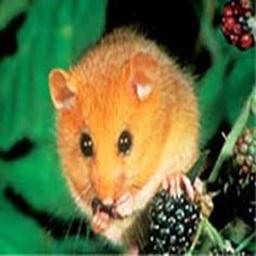  | 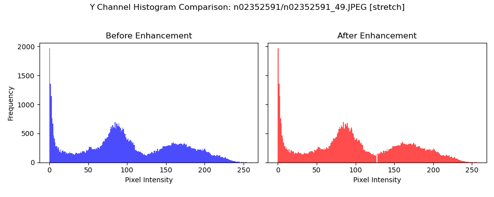  |
| Gamma    | 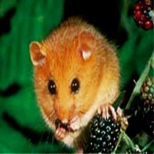    | 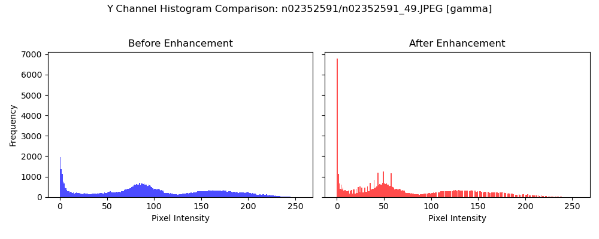    |

### 🚜 拖拉机类（n04465501）

| 增强方法 | 增强后图像                                           | 增强前后直方图                                            |
| -------- | ---------------------------------------------------- | --------------------------------------------------------- |
| Equalize |  | 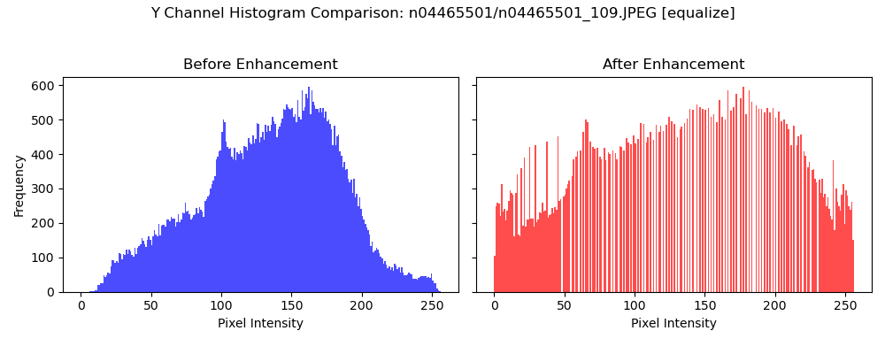 |
| Clahe    |     | 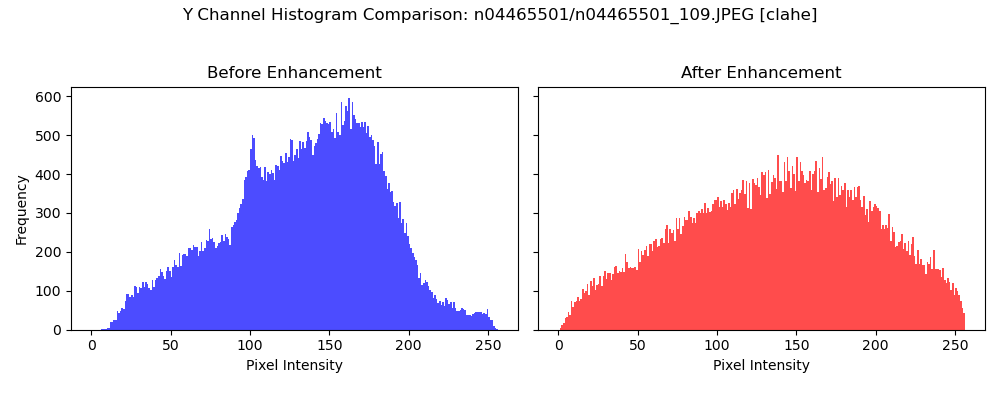    |
| Stretch  |   | 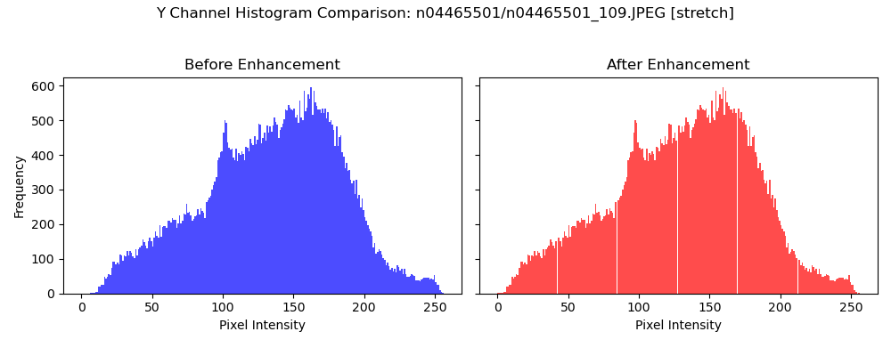  |
| Gamma    |     | 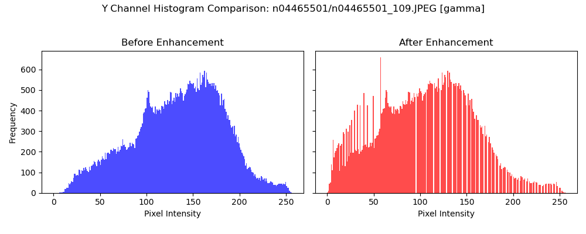    |

## 六、统计与对比结果

| 类别   | 原图数量 | 有效增强图数量 | 增强后平均亮度提升（主观） |
| ------ | -------- | -------------- | -------------------------- |
| 猫     | 1525 张  | 1525 张       | 中等偏高                   |
| 老鼠   | 654 张   | 654 张         | 高，原图普遍偏暗           |
| 拖拉机 | 1726 张  | 1726 张        | 高，逆光和背光图效果显著   |

## 七、小结与展望

本项目完成了从数据预处理（下载、解压、Resize）到四种增强方法的算法实现、测试与对比。使用纯 Python 实现了直方图统计与插值逻辑，深入掌握了增强算法原理与细节。

* `equalize` 简洁高效，适合基础增强；
* `clahe` 提升局部对比度，适用于细节敏感任务；
* `stretch` 更平滑、无伪影，适用于动态范围不足图像；
* `gamma` 提供灵活亮度调控，适用于主观感知优化。
