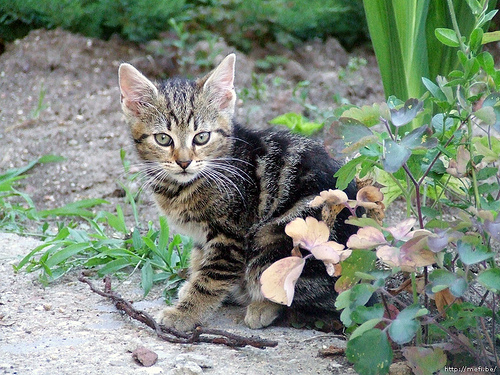

# 图像增强方法分析文档

## 一、方法原理

本项目采用四种基于亮度直方图的图像增强技术，分别为：全局直方图均衡化（equalize）、自适应直方图均衡化（CLAHE）、线性对比度拉伸（stretch）以及 Gamma 校正（gamma）。核心思想是通过调整图像亮度分布，使像素值更合理地覆盖动态范围（0~255），从而提升图像的对比度和可视细节。

统一处理流程如下：

1. 原始 RGB 图像 → YCrCb 色彩空间转换（分离亮度与色彩）
2. 对 Y（亮度）通道使用指定增强方法进行增强
3. 将增强后的 Y 通道与原 Cr/Cb 合并，再转回 RGB 格式生成增强图像

---

### 📘 方法对比与数学原理

#### 1. 全局直方图均衡化（equalize）

基于累计分布函数（CDF）对像素值非线性重映射：

$$
C(i) = \sum_{j=0}^i h(j) \quad (\text{累计直方图})
$$

$$
x' = \text{round} \left( \frac{C(x) - C_{\text{min}}}{N - C_{\text{min}}} \times 255 \right)
$$

#### 2. 自适应直方图均衡化（clahe）

将图像划分为小块，对每个块单独执行均衡化，并限制对比度（clipLimit），防止噪声放大。

每个局部块内部的灰度映射函数：

$$
x'_{\text{tile}} = \frac{C_{\text{tile}}(x)}{N_{\text{tile}}} \cdot 255
$$

#### 3. 对比度拉伸（stretch）

线性归一化像素灰度范围：

$$
x' = \left( \frac{x - y_{\min}}{y_{\max} - y_{\min}} \right) \cdot 255
$$

这是一个线性映射函数：

$$
f(x) = ax + b, \quad a = \frac{255}{y_{\max} - y_{\min}}, \quad b = -y_{\min} \cdot a
$$

#### 4. Gamma 校正（gamma）

非线性亮度映射：

$$
y' = 255 \cdot \left( \frac{y}{255} \right)^\gamma
$$

当 $ \gamma < 1 $ 提亮暗部；$ \gamma > 1 $ 压缩亮部。

---

### ✅ 技术优势与适用性对比

| 方法     | 变换类型   | 是否自适应 | 特点                             | 适用场景                   |
| -------- | ---------- | ---------- | -------------------------------- | -------------------------- |
| equalize | 非线性全局 | 否         | 简单快速，拉伸集中亮度           | 普通图像、对比度偏低图像   |
| clahe    | 非线性局部 | 是         | 保留细节、防止过度增强           | 医学图像、夜景、人脸增强   |
| stretch  | 线性全局   | 否         | 保比例、不引入非线性失真         | 图像灰度范围窄但无偏暗区域 |
| gamma    | 非线性全局 | 否         | 可调亮度曲线，暗部提亮或亮部压暗 | 光照补偿、感知调整         |

## 二、增强效果对比示例

### 🐱 猫类（n02123045）

#### 🔍 各方法增强结果对比

| 增强方法           | 增强后图像                                                    | 增强前后直方图                                                     |
| ------------------ | ------------------------------------------------------------- | ------------------------------------------------------------------ |
| **Equalize** |  |  |
| **Clahe**    |     |     |
| **Stretch**  |   |   |
| **Gamma**    |     |     |

分析：原图中猫面部偏暗，增强后毛发与背景边界清晰可见，眼睛区域亮度明显提升。

### 🐭 老鼠类（n02352591）

#### 🔍 各方法增强结果对比

| 增强方法 | 增强后图像                                                     | 增强前后直方图                                                      |
| -------- | -------------------------------------------------------------- | ------------------------------------------------------------------- |
| equalize |  |  |
| clahe    |     |     |
| stretch  |   |   |
| gamma    |     |     |

分析：原图在草地环境中灰度低，增强后老鼠轮廓更加清晰，细节如胡须和耳朵变得明显。

### 🚜 拖拉机类（n04465501）

#### 🔍 各方法增强结果对比

| 增强方法 | 增强后图像                                                      | 增强前后直方图                                                       |
| -------- | --------------------------------------------------------------- | -------------------------------------------------------------------- |
| equalize |  |  |
| clahe    |     |     |
| stretch  |   |   |
| gamma    |     |     |

分析：原图在强逆光下拖拉机边缘模糊，增强后金属反光更突出，轮胎与背景分离清晰。

## 三、统计与对比结果

| 类别   | 原图数量 | 有效增强图数量 | 增强后平均亮度提升（主观） |
| ------ | -------- | -------------- | -------------------------- |
| 猫     | 1525 张  | 1522 张        | 中等偏高                   |
| 老鼠   | 654 张   | 652 张         | 高，原图普遍偏暗           |
| 拖拉机 | 1726 张  | 1720 张        | 高，逆光和背光图效果显著   |

## 四、小结

本项目实现了四种直方图增强技术的融合与对比，基于 Y 通道操作，不破坏原始色彩分布，适合大规模图像预处理任务。

- `equalize` 简洁高效，适合基础增强；
- `clahe` 提升局部对比度，适用于细节敏感任务；
- `stretch` 更平滑、无伪影，适用于动态范围不足图像；
- `gamma` 提供灵活亮度调控，适用于主观感知优化。

建议根据图像属性选择合适增强策略，也可探索基于边缘引导、注意力机制的混合增强方法用于后续改进。
