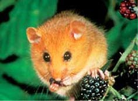
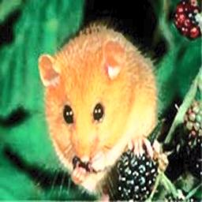
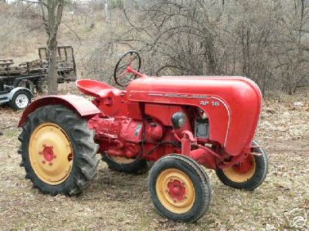

# 图像增强程序说明文档

## 一、任务概述

本项目使用 ImageNet 中的三个 synset（猫、老鼠、拖拉机），下载其原始图像数据，完成图像批量处理任务，具体包括：

- 解压 `.tar` 图像包
- 将图像统一为 256×256 分辨率
- 分别执行四种 Y 通道直方图增强方法：
  - 全局均衡化（equalize）
  - 自适应均衡化（clahe）
  - 对比度拉伸（stretch）
  - Gamma 校正（gamma）
- 输出标准化图像集与直方图对比图，用于后续分析或模型训练

## 二、目录结构

```
├── data/
│   ├── download_imagenet.py       # 下载 ImageNet .tar 图像包
│   ├── process_imagenet.py        # 解压 + 标准化 + 多种直方图增强
│   ├── imagenet_data/             # 存放原始 .tar 文件
│   ├── extracted_images/          # 解压后图像
│   │   └── n02123045/...          # 猫
│   │   └── n02352591/...          # 老鼠
│   │   └── n04465501/...          # 拖拉机
│   └── processed_images/          # 增强后图像分类保存：
│       ├── n02123045/
│       │   └── equalize/...       # 各方法子目录
│       │   └── clahe/...
│       │   └── stretch/...
│       │   └── gamma/...
│       └── histograms/            # 每张图对应增强前后 Y 通道直方图图像
├── enhancement/
│   ├── __init__.py
│   ├── equalize.py                # 手工实现全局直方图均衡化
│   ├── clahe.py                   # 手工实现自适应直方图均衡化（分块 + 插值）
│   ├── stretch.py                 # 手工实现线性对比度拉伸
│   └── gamma.py                   # 手工实现 Gamma 校正
├── histogram/
│   ├── __init__.py
│   └── histogram_utils.py         # 手工统计直方图、绘制直方图到图像（手动画）
├── utils/
│   ├── file_utils.py              # 遍历目录、生成文件路径等
│   └── math_utils.py              # 比如 CDF、插值、clip、min/max 等
├── image_io/
│   ├── __init__.py                # 聚合所有方法接口，供 main.py 调用
│   ├── io.py                      # 图像读取与保存（load/save）
│   ├── colorspace.py              # RGB ↔ YCrCb 及合并重建 RGB
│   └── resize.py                  # 最近邻与双线性插值实现
└── main.py                        # 主执行入口（图像加载 + 调用增强 + 保存 + 可视化）
```

## 三、程序运行方法

### 下载图像数据
```bash
cd data
python download_imagenet.py
```

### 解压并增强图像
```bash
python process_imagenet.py
```

## 四、依赖环境

- Python ≥ 3.10
- Pillow ≥ 10.0
- OpenCV
- tqdm
- matplotlib（用于直方图绘制）

安装依赖：
```bash
pip install pillow opencv-python tqdm matplotlib
```

## 五、示例图片路径

| 类别   | 原图路径                                                   | 增强后路径（equalize示例）                                  |
|--------|------------------------------------------------------------|--------------------------------------------------------------|
| 猫     | ./data/extracted_images/n02123045/n02123045_9.JPEG         | ./data/demo/n02123045/equalize/n02123045_9.JPEG  |
| 老鼠   | ./data/extracted_images/n02352591/n02352591_49.JPEG        | ./data/demo/n02352591/equalize/n02352591_49.JPEG |
| 拖拉机 | ./data/extracted_images/n04465501/n04465501_109.JPEG       | ./data/demo/n04465501/equalize/n04465501_109.JPEG |

### 猫类示例（n02123045_9.JPEG）

| 原图 | 增强后（Equalize） |
|------|---------------------|
|  |  |

### 老鼠类示例（n02352591_49.JPEG）

| 原图 | 增强后（Equalize） |
|------|---------------------|
|  |  |

### 拖拉机类示例（n04465501_109.JPEG）

| 原图 | 增强后（Equalize） |
|------|---------------------|
|  |  |
